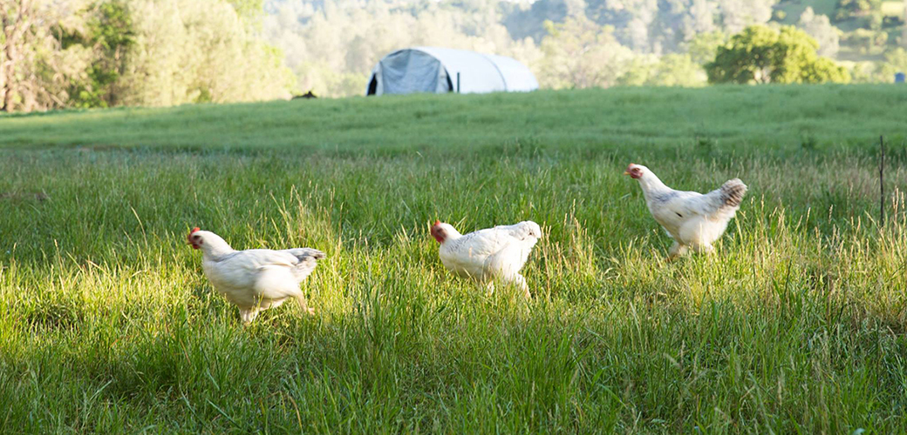
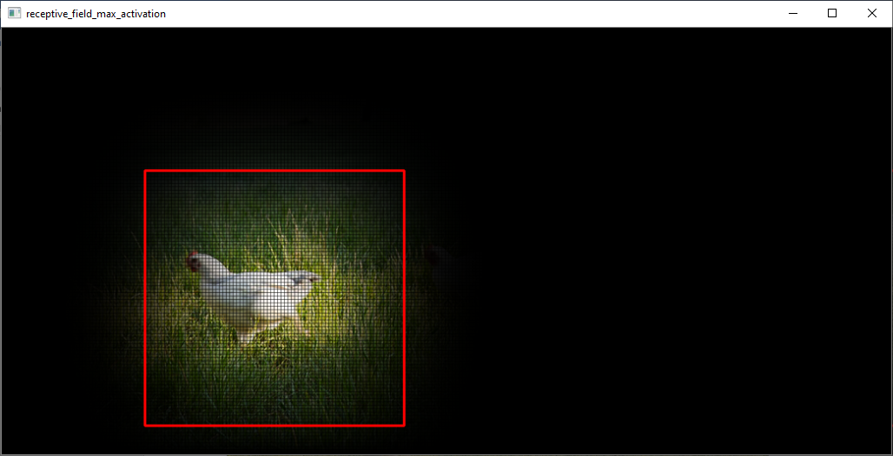
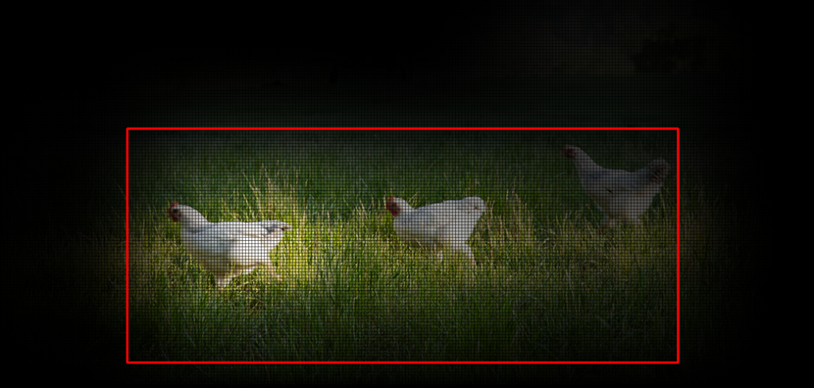

# Fully Convolutional Networks and Receptive Fields

## Using Fully Convolutional Networks for Image Classification

Typically CNN models used for image classification work with fixed size inputs.

Using such models in your application requires one to crop or resize the input images as per the dimensions imposed by the underlying CNN architecture.

However this approach leads to certain limitations as below which may cause significant degradation in model performance/accuracy:
- Loss of resolution
- Non-square aspect ratio

For example, consider the sample image below:

The pretrained Resnet18 classifier in torchvision library gives by the following result for the above image:
> **Top 5 predictions:**

>> Predicted Class:[ptarmigan], Prob:[3.23%]

>> Predicted Class:[hen], Prob:[2.87%]

>> Predicted Class:[partridge], Prob:[2.5%]

>> Predicted Class:[crane], Prob:[2.23%]

>> Predicted Class:[vulture], Prob:[1.8%]

In order to overcome above mentioned issues, Fully Convolutional Networks (FCNN) can be used.

By definition, FCNNs architectures comprise of only Convolutional layers i.e. there are no Fully Connected/Linear layers in these networks.

Although it does add a few extra steps in extracting the predicted class, the benefits in accuracy far outweigh this slight inconvenience.

In the file `FullyConvolutionalResnet18.py`, we take a **Resnet18** PyTorch model pretrained on Imagenet dataset and replace the final Fully Connected/Linear layer with a Convolution layer and copy the corresponding weights.

This gives us a **Resnet18-FCNN** model which can make predictions on images of arbitary dimensions without performing any resize or crop operation.

Using the FCN, we are able to improve the classification results as below:
> **Top 5 predictions:**

>> Label:[hen], Probability:[58.9%]

>> Label:[mountain tent], Probability:[39.9%]

>> Label:[partridge], Probability:[13.8%]

>> Label:[rugby ball], Probability:[2.92%]

>> Label:[hay], Probability:[1.32%]

## Computing CNN Receptive Fields through backpropagation

Receptive field for a pixel in a feature map in a CNN represents all the pixels from the previous feature maps that affected its value.

It is a very useful tool for debugging CNNs and to understand what the network “saw” and analyzed to predict the final class.

And it can also be used to obtain a fairly accurate bounding box of the predicted object.

The file `ReceptiveFieldBackpropagation.py` uses the **Resnet18-FCNN** model from above and the backpropagation algorithm to compute the receptive field of the pixel corresponding to the predicted class in the final CNN layer.

