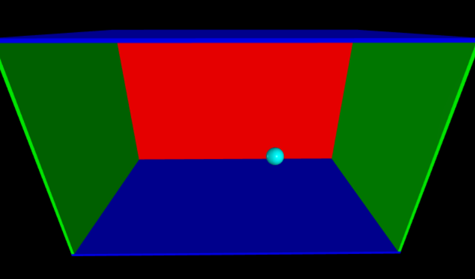
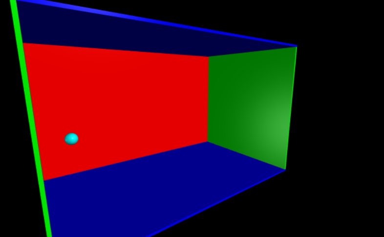

# VPython demo

A simple bouncing ball in a box example to demonstrate VPython library.

#### Install VPython
Follow the steps mentioned in [vpython installation page](https://vpython.org/presentation2018/install.html).

Refer to the [vpython homepage](https://vpython.org/) for mouse based user interaction options.

Sample Screenshots:

