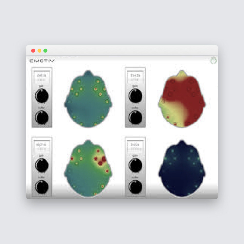
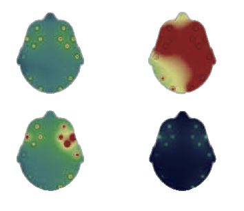

## Extract specific content from an image

This code shows how we can extract specific contents from a given image using OpenCV.

As an example, I have taken an image of a brain scan report and the goal is to extract the 4 specific brain scans from this image.

Further applications may include training a machine learning model using a dataset of such extracted scans to help diagnose specific medical conditions.

Refer to the [blog post](https://medium.com/object-extraction-from-images-using-opencv-python/extracting-regions-of-interest-from-images-dacfd05a41ba) for a detailed explanation of the steps.

#### Input Image:

#### Extracted content:

#### Usage:
> python extract_image_content.py --image Image1.png

