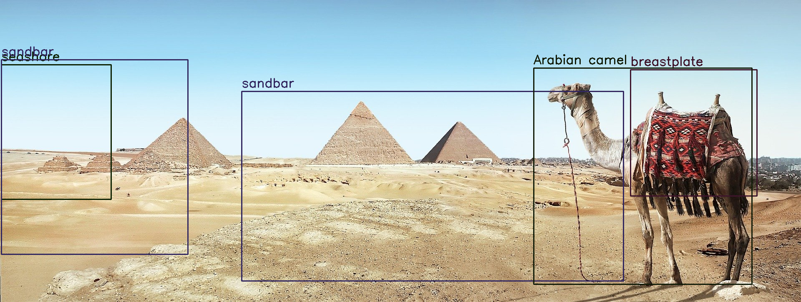
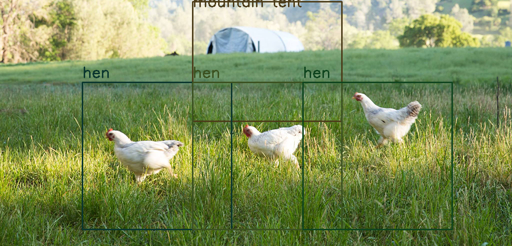
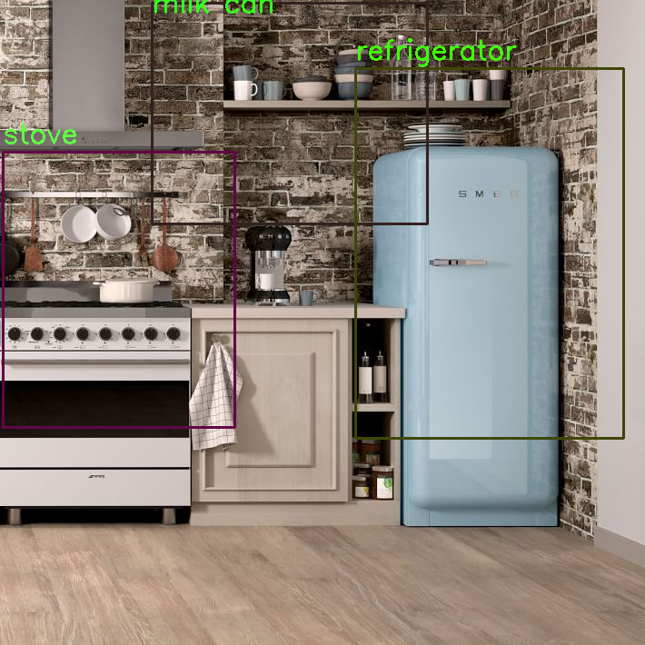

# Using FCNN Receptive Fields for Object Detection

This implementation describes an approach to create an **Object Detection** model from a pretrained **Image Classification** model in PyTorch.

The idea and the implementation presented in this post are built using concepts of **CNN Receptive Fields, Backpropagation and Fully Convolutional Networks**.

This implementation extends the concepts presented in the following posts from LearnOpenCV.com

- [Fully Convolutional Image Classification on Arbitrary Sized Image](https://www.learnopencv.com/fully-convolutional-image-classification-on-arbitrary-sized-image/)
-	[CNN Receptive Field Computation Using Backprop](https://www.learnopencv.com/cnn-receptive-field-computation-using-backprop/)

For this exercise, I have used a slightly modified version of the pretrained Resnet-18 model provided in PyTorch.

Specifically, the model used is a variant of Resnet-18, in which the final (and only) Fully Connected (or Linear) layer of the model is replaced by a 2D Convolution layer, thus converting the model into a Fully Convolutional Neural Network (FCNN).

Refer the corresponding [blog post](https://towardsdatascience.com/using-fcnn-receptive-fields-for-object-detection-8101d7acecff) for a detailed explanation.

### Usage:
> python ReceptiveFieldObjectDetector.py --input res/kitchen.jpg

### Sample results:

