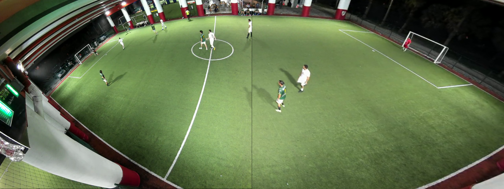

# Video Stitching using OpenCV

This implementation shows an approach for stitching two videos capturing the same scene from different angles using OpenCV's keypoint matching algorithms.

### Usage:
> python stitch_video.py --video1 sample/test_0.mp4 --video2 sample/test_1.mp4 --output sample/stitched_video.mp4

### Sample results:

