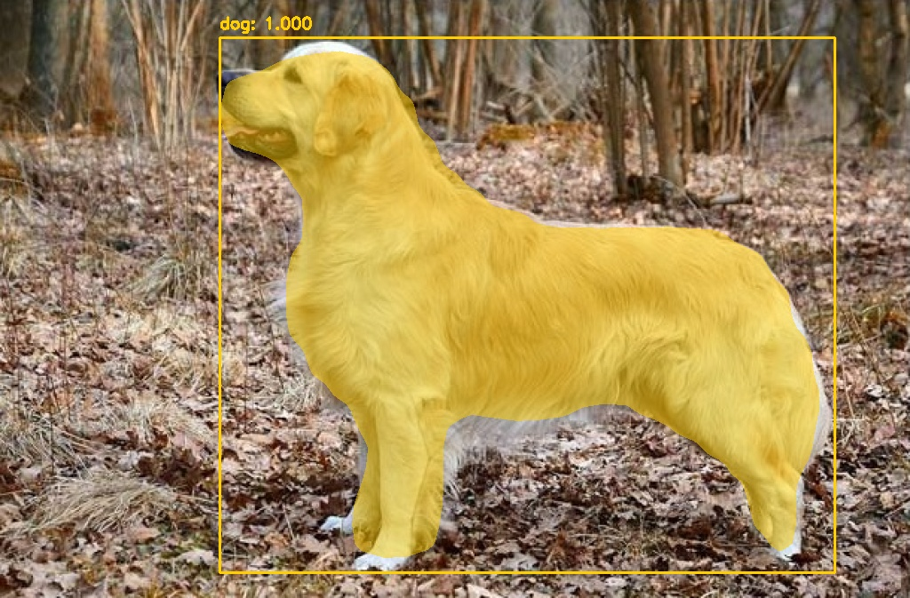

# Semantic Segmentation based on Matterport Mask RCNN

MaskRCNN library used from [this link](https://github.com/akTwelve/Mask_RCNN) as original version is not compatible with Tensorflow 2.0

Download pretrained weights from [this link](https://github.com/matterport/Mask_RCNN/releases).

### Usage:
> python maskrcnn_predict.py --weights mask_rcnn_coco.h5 --labels coco_labels.txt --image images/sample2.jpg

### Sample result:

