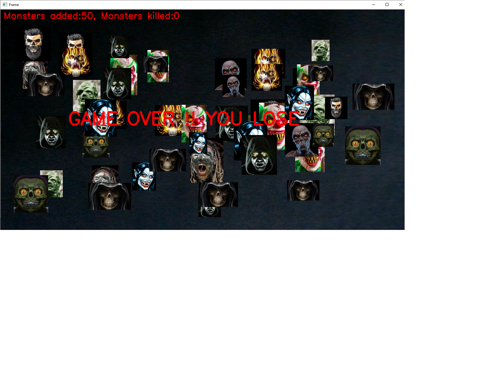

# Simple Augmented Reality based Single Player Game

An single player game developed as a fun Computer Vision project that combines aspects such as face detection, image overlay, object detection etc to create a feeling of augmented reality.

### Sample Screenshot

