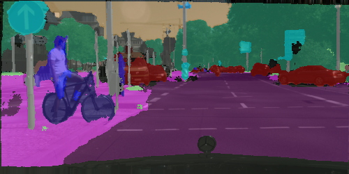

# Semantic Segmentation example using OpenCV

This implementation is reproduced from an excellent tutorial in [pyimagesearch](https://www.pyimagesearch.com/).

### Usage:
> python segment.py --model enet-cityscapes/enet-model.net --classes enet-cityscapes/enet-classes.txt --colors enet-cityscapes/enet-colors.txt --image images/example_01.png

### Sample Output

