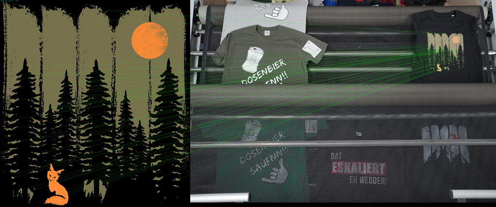

# Pattern Matching with OpenCV

This implementation uses OpenCV feature extraction and pattern matching algorithms to find and detect correct patterns printed on T-Shirts.

### Usage
> python test.py --image images/DSC04886.JPG --pattern images/4VY1YHI4.png

### Sample Output

